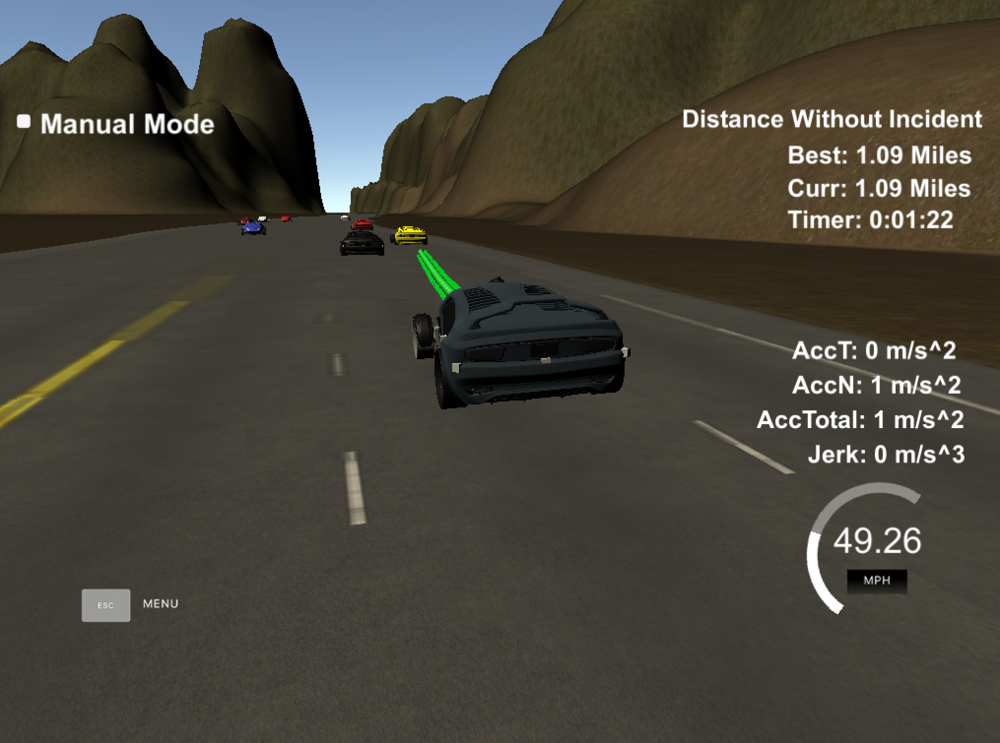

# CarND-Path-Planning-Project

### Project
In this project I designed a path planner that is able to create smooth, safe paths for a car driving in the Udacity highway simulator (https://github.com/udacity/self-driving-car-sim). It is able to follow along a 3 lane highway with traffic, is able to keep inside its lane, avoids hitting other cars, and is able to pass slower moving traffic by using localization, sensor fusion, and map data.




## Basic Build Instructions

1. Clone this repo.
2. Make a build directory: `mkdir build && cd build`
3. Compile: `cmake .. && make`
4. Run it: `./path_planning`.

## Dependencies

* cmake >= 3.5
  * All OSes: [click here for installation instructions](https://cmake.org/install/)
* make >= 4.1
  * Linux: make is installed by default on most Linux distros
  * Mac: [install Xcode command line tools to get make](https://developer.apple.com/xcode/features/)
  * Windows: [Click here for installation instructions](http://gnuwin32.sourceforge.net/packages/make.htm)
* gcc/g++ >= 5.4
  * Linux: gcc / g++ is installed by default on most Linux distros
  * Mac: same deal as make - [install Xcode command line tools]((https://developer.apple.com/xcode/features/)
  * Windows: recommend using [MinGW](http://www.mingw.org/)
* [uWebSockets](https://github.com/uWebSockets/uWebSockets)
  * Run either `install-mac.sh` or `install-ubuntu.sh`.
  * If you install from source, checkout to commit `e94b6e1`, i.e.
    ```
    git clone https://github.com/uWebSockets/uWebSockets
    cd uWebSockets
    git checkout e94b6e1
    ```
## Model

### Prediction (lines 104-138)

The model implemented predicts all vehicle locations (Frenet `s` coordinates) into the future and then checks if there is a car either
- in front,
- left,
- or right
from the current car in a corridor of 30m.

### Behavior (lines 141-164)

Based on the predicted vehicle positions it is decided to
- keep the lane and slow down/accelerate,
- overtake a slow vehicle given an adjacent lane is free of traffic,
- switch back to the centre lane (our reference lane)

### Trajectory generation (lines 167-262)

Trajectory generation makes use of the spline library (http://kluge.in-chemnitz.de/opensource/spline/). In order to smoothen the trajectory the spline is initialized with the two previous `x` and `y` values as anchor points (lines 180-202). Calculations are done in the local car coordinate system (lines 218-224) to simplify calculations. Existing path points are re-used (lines 231-234), new points are generated as a diff to the previous path, spaced out evenly to result in the desired velocity of the car (lines 243-262).
